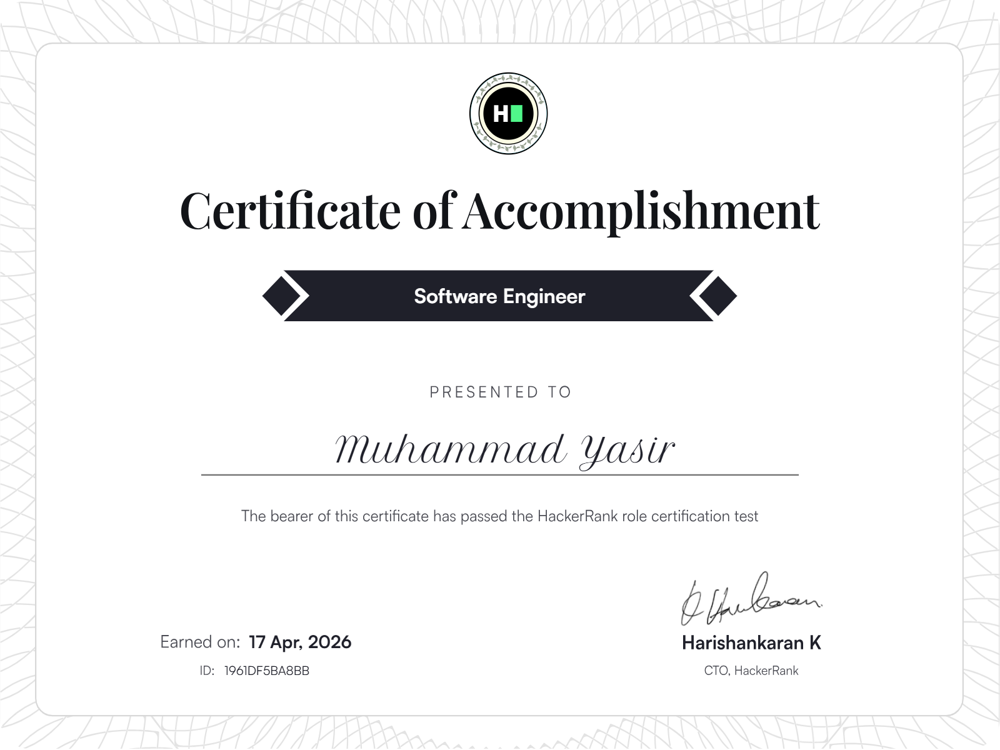

#  Software Engineering Coding Challenges

## 📊 Repository Stats

---

#  About This Repository

This repository is a collection of **software engineering coding challenges, problem-solving exercises, and real-world practice tasks**.

It reflects my journey as a **Full Stack Developer**, where I continuously improve my **coding, logic building, and development skills**.

Most of the problems are solved while practicing on platforms like **HackerRank** and similar coding environments.

---

#  Goals of This Repository

✔ Improve **problem solving skills**

✔ Practice **software engineering concepts**

✔ Build strong **logical thinking**

✔ Maintain organized **coding solutions**

✔ Showcase a **professional GitHub portfolio**

✔ Strengthen **full stack development expertise**

---

#  Technologies & Languages Used

---

#  HackerRank Certification

🔗 **Verify Certificate:**
https://www.hackerrank.com/certificates/1961df5ba8bb

🔗 **Live Preview (Embed):**
https://www.hackerrank.com/certificates/iframe/1961df5ba8bb

# 🧩 Coding Platforms

🔗 **Profile Link:**
https://www.hackerrank.com/profile/YasirAwan4831

Practice challenges are taken from:

* HackerRank
* Personal coding practice
* Problem solving exercises

# 👨‍💻 Author

## Muhammad Yasir

**Full Stack Web Developer**

Passionate about building **modern web applications, solving coding challenges, and continuously improving software engineering skills**.

🌐 Portfolio
https://yasirawaninfo.vercel.app/
https://myasirawaninfo.vercel.app/

---

# ⭐ Support

If you find this repository useful:

⭐ Star this repository

🍴 Fork and explore

📢 Share with other developers

---

#  Continuous Learning

> “Consistency beats talent. Code every day and improve step by step.”

This repository will keep growing with more **coding challenges, solutions, and improvements**.

---

🔥 Keep Coding | Keep Growing | Never Stop Learning

<!-- WAVE DIVIDER -->

