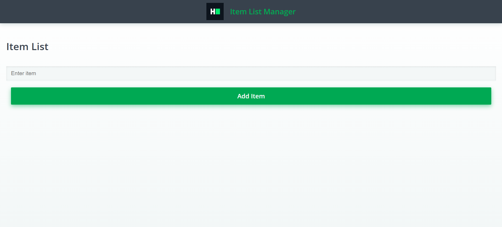

#  Task-1: Item List Manager

A simple and interactive **React application** that allows users to dynamically add items to a list.  
This task demonstrates practical usage of **React Hooks** and state management while creating a minimal and functional UI.

---

##  Features

- 🟢 Add items to the list dynamically  
- 🟢 Clear input field after adding an item  
- 🟢 Render list items using `map()` in React  
- 🟢 Beginner-friendly and clean React implementation  
- 🟢 Fully responsive and interactive UI

---

## 📂 Files in this Task

| File | Description |
|------|-------------|
| **App1.js** | Original coding challenge code (before implementation) |
| **App2.js** | Completed solution with implemented logic |
| **preview/output.png** | Screenshot showing the task output |

---

## 🖼 Preview

---

## 🛠 Technologies Used

- **React.js** – Functional components & hooks  
- **JavaScript (ES6+)** – State management and event handling  
- **HTML5 & CSS3** – Minimal styling  
- **h8k-components** – Prebuilt UI components  

---

## 🎯 Learning Outcomes

- Understand **React state management** using hooks (`useState`)  
- Implement **dynamic rendering** of list items  
- Practice **clean and modular code structure**  
- Gain experience in **frontend component-based development**

---

## 👨‍💻 Author

**Muhammad Yasir**  

**Contact:** [https://yasirawaninfo.vercel.app/](https://yasirawaninfo.vercel.app/)  

Full Stack Web Developer  
Passionate about building modern web applications and improving software engineering skills.

---

⭐ If you like this task, consider giving it a **star**.