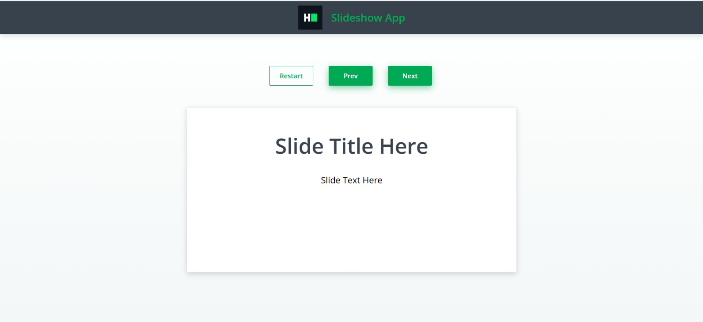

# 🧩 Task-2: Slide Navigation Component

A **React Slide Navigation Component** that allows users to navigate through multiple slides dynamically.  
This task demonstrates **React state management, conditional rendering, and button logic**.

---

## ✨ Features

- 🔹 Navigate slides with **Next, Prev, and Restart buttons**  
- 🔹 Disable buttons when at the first or last slide  
- 🔹 Dynamic slide **title and text rendering**  
- 🔹 Fully interactive and beginner-friendly React component  
- 🔹 Clean UI layout with **card-based styling**  

---

## 📂 Files in this Task

| File | Description |
|------|-------------|
| **slides1.js** | Initial Slide component structure (static placeholders) |
| **slides2.js** | Completed Slide component with implemented logic |
| **preview/output.png** | (Optional) Screenshot showing slide navigation UI |

---

## 🖼 Preview

  

*Replace this image with actual screenshot if available.*

---

## 🛠 Technologies Used

- **React.js** – Functional components & Hooks (`useState`)  
- **JavaScript (ES6+)** – State management & logic handling  
- **HTML5 & CSS3** – Component styling  
- **h8k-components** – Optional prebuilt UI components  

---

## 🎯 Learning Outcomes

- Implement **dynamic UI updates** with React state  
- Learn **conditional rendering** and button enable/disable logic  
- Practice **component-based architecture**  
- Improve **problem-solving and React coding skills**  

---

## 👨‍💻 Author

**Muhammad Yasir**  

**Contact:** [https://yasirawaninfo.vercel.app/](https://yasirawaninfo.vercel.app/)  

Full Stack Web Developer  
Passionate about building modern web applications and improving software engineering skills.

---

⭐ If you like this task, consider giving it a **star** on GitHub!